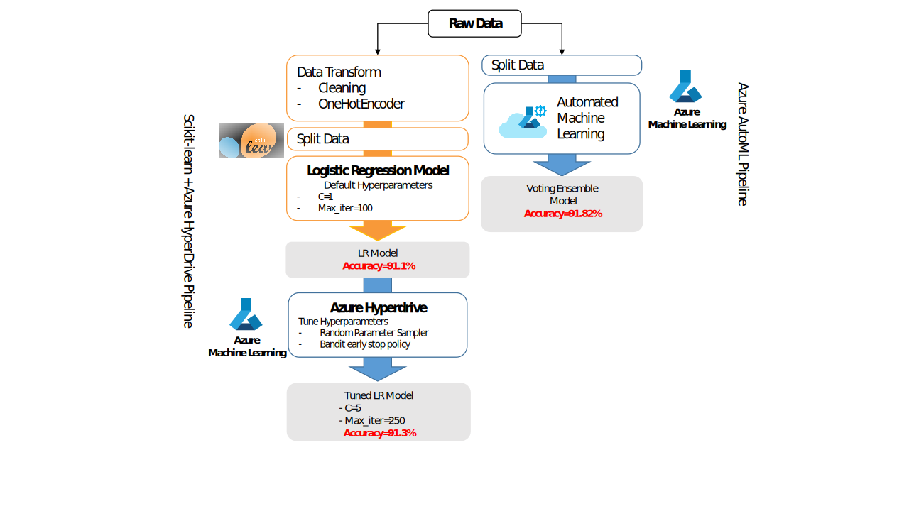

# Udacity Machine Learning Engineer Nanodegree with Microsoft Azure

These projects are related to the Udacity Azure Machine Learning Engineer Nanodegree. 
In this program, students will enhance their skills by building and deploying sophisticated machine learning solutions using popular open source tools and frameworks, and gain practical experience running complex machine learning tasks using the built-in Azure labs accessible inside the Udacity classroom.

The architecture of each project is presented in the next sections:

## Project 1 - Optimizing Machine Learning Pipeline in Azure

## Project 2 - Operationalizing Machine Learning

