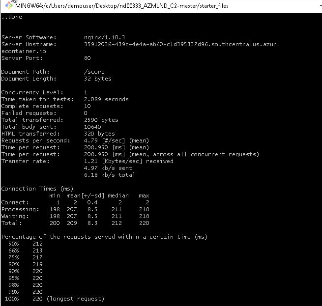

# Operationalizing Machine Learning

In this project, I work with the [Bank Marketing dataset](https://automlsamplenotebookdata.blob.core.windows.net/automl-sample-notebook-data/bankmarketing_train.csv) to predict if the client will subscribe to bank term deposit [yes or no]. I use Azure to obtain a classification model using AutoML and configure a cloud based machine learning production model. The model is deployed and consumed. Logging and performance with [Apache Bench](https://httpd.apache.org/docs/2.4/programs/ab.html) are presented. The RESTful API documentation is generated with [Swagger](https://swagger.io/). Finally, a pipeline of the process is created, published and consumed. I show how to automate the pipeline process with a HTTP trigger. 

## Contents
1. [Architectural Diagram](#id-arch)
1. [Key Steps](#id-key)
1. [Screen Recording](#id-screen)
1. [Standout Suggestions](#id-suggestions)


<div id='id-arch'/>

# Architectural Diagram

The Architetural Diagram of the project is presented in the next Figure. 


In the key steps section we present with details each step of the Architectural Diagram.

<div id='id-key'/>

# Key Steps

## Authentication

A user named "Service Principal", has controlled permissions to access specific resources in Azure. Using a service principal is a great way to allow authentication while reducing the scope of permissions, which enhances security. This step was not done since students does not have access to create a Service Principal.

## AutoML Run 

The first step of an automated ML experiment is to register the bank marketing dataset:


The autoML used is set to a classification problem, with the objective to predict the `Y` binary variable, as a Yes or No subscription of the bank term. The autoML process is extensively described in the previous project (Optimizing ML Pipeline in Azure). The completed run is depicted as:


The best model using the accuracy of 0.9192 as the main metric is the Voting Ensemble:


## Deploy best model

The best model was deployed in [Azure Container Instance (ACI)](https://docs.microsoft.com/en-us/azure/container-instances/container-instances-quickstart), with required authentication.


## Enable Logging
Logging is essential to evaluate possible errors. In Azure ML we need to enable the `Application Insigths` using the cloud interface or using the python code in `logs.py`. 

```python

service.update(enable_app_insights=True)

```

The following figure shows the Application Insights flag enabled and some logs captured.

*Model deployment*


*Detailed log from log.py.*


## Consume  model endpoint

To consume the deployed model, Azure generates a RESTful API endpoint. To access the endpoint, there is an URI address and an authentication method that can be a Token or a Key.  The endpoint.py file creates a HTTP connection To interact with the model endpoint. This is done in in the script endpoint.py, where we enter the URI, KEY and make an HTTP POST. 

*Consume endpoint information, URI and Key.*


The followinf figure shows the scoring_uri and the key inside the `endpoint.py` script. We use this information and a hypothetical new data to evaluate if the bank term will be signed. In the following figure, the endpoint.py script is executed in the PowerShell. The response for two sets of data are "NO" and "NO".


## Benchmark 
I also test the performance of the model enpoint using [Apache Benchmark (AB) tool](https://httpd.apache.org/docs/2.4/programs/ab.html). The tool is especially useful to show how many requests per second the endpoint is capable of serving. In the `benchmark.sh` file, 10-20 HTTP requests are performed, and its performance are measured.

*script execution*


*performance results*


## Swagger documentation

To consume the model, besides knowing the REST endpoint URI, it is important to know how to use the API. What methods are available, its inputs and outputs, possible exceptions. [Swagger](https://swagger.io/) is a tool that helps build, document, and consume RESTful web services like the ones deployed in Azure ML Studio. It further explains what types of HTTP requests that an API can consume, like POST and GET. Azure provides a `swagger.json` that is used to create a web site that documents the HTTP endpoint for a deployed model. 

We will run swagger locally (LocalHost) by using a [docker](https://www.docker.com/) file with a swagger-ui environment [(documentation)](https://hub.docker.com/r/swaggerapi/swagger-ui), as show in screen bellow.

*swagger deployed with docker*


I use the `serve.py` script to create an HTTP server to expose the current working directory. It is meant to be an easy way to expose a local `swagger.json` file so thata swagger-ui service can pick it up from localhost.

The next screens show the available methods and details as ServiceInput, ServiceOutput and ErrorResponse.

*methods avaialable and detailse extracted from Azure generated json*


## Create and publish a pipeline

After the model is deployed we can create the Pipeline of the entire process and share it with other team members. We use the notebook `aml-pipelines-with-automated-machine-learning-step.ipynb` to create the Pipeline.

*Pipeline creation*


 The next step is to publish as a endpoint.

*Pipeline Active endpoint*


The pipeline details is presented in the diagram, where the Bankmarketing dataset is followed by an AutoML module.

*Published Pipeline Overview*


*Pipeline Run details*


We can schedule the Pipeline using the Jupyter Notebook and Python:


*Scheduled Pipeline*


<div id='id-screen'/>

# Screen Recording

The link for the screen recording where I demonstrate the following topics:

- Working deployed ML model endpoint
- Deployed Pipeline
- Available AutoML Model
- Succesful API requests to the endpoint with a JSON payload

https://www.youtube.com/watch?v=l6hDFnOFl98


<div id='id-suggestions'/>

# Standout Suggestions and Project Improvement

Here are my suggestions for project improvement 

- Enable the creation of a Service Principal for authentication and securitiy using az commands. It was not possible unless using a personal account.

- Use Azure Kubernetes Service (AKS) to deploy the model as Kubernetes is widely used for container orchestration.

- We could feed data to the model endpoint and monitor the model drift or other changes. Hence, we could implement alarms as a real application.

