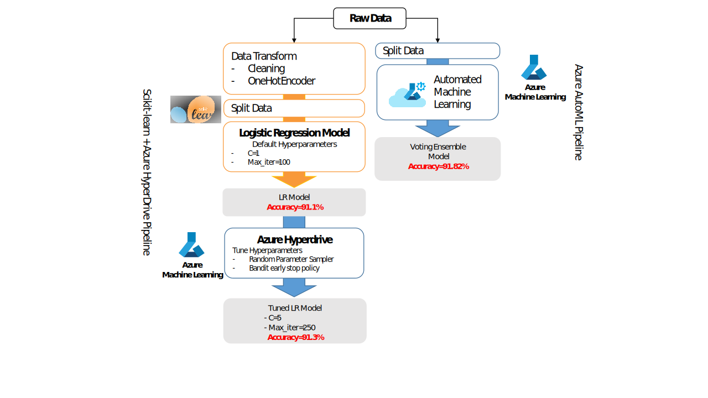

# Optimizing ML Pipeline in Azure

**Bank deposit prediction**

## Contents
1. [Overview](##Overview)
1. [Summary](##Summary)
1. [Scikit-learn and Hyperdrive Pipeline](#id-scikit)
1. [AutoML Pipeline](##id-AutoML)
1. [Pipeline Comparison](#id-pipeline)
1. [Future Work](#id-future)
1. [Proof of cluster clean up](#id-clusterclean)
1. [Development Environment](#id-devenv)


## Overview
---
This project is part of the Udacity Azure ML Nanodegree.
In this project, we build an Azure ML pipeline using the Python SDK and a provided Scikit-learn Logistic Regression model. We use **Hyperdrive** to optimize the hyperparameters and also generate another model with Azure **AutoML** tool for comparison. 

The `Machine Learning Pipeline Architecture` is presented in the following image:



All the steps are explained in the next sections.

## Summary
---
The project uses this [dataset](https://automlsamplenotebookdata.blob.core.windows.net/automl-sample-notebook-data/bankmarketing_train.csv) <sup>[1](#id-notes)</sup> which contains data from direct marketing campaigns of a portuguese banking institution. The marketing campaigns were based on phone calls to convince potential clients to subscribe to bank's term deposit. The dataset have 20 variables from the clients that the classifier can use to predict whether the potential client would accept and make a term deposit at the bank or not (y= 1 or 0). 

The best performing model found using AutoML was a Voting Ensemble with 91.8% accuracy, while the accuracy of the Logistic classifier implemented using hyperdrive was 91.3%


<div id='id-scikit'/>

## Scikit-learn and Hyperdrive Pipeline

---

### **Scikit-learn**
The first step of the project is to create a scikit-learn [Logistic Regression Model](https://scikit-learn.org/stable/modules/generated/sklearn.linear_model.LogisticRegression.html#sklearn.linear_model.LogisticRegression) file (`train.py`) for classification. The steps are detailed as follow:

1. Azure TabularDataset is created using the TabularDatasetFactory and the dataset [url]("https://automlsamplenotebookdata.blob.core.windows.net/automl-sample-notebook-data/bankmarketing_train.csv")  

2. Data is then cleaned and pre-processed using clean_data function, this includes Binary encoding and One Hot Encoding of categorical features

3. Data is then split into 80:20 ratio for training and testing

4. Define a Scikit-learn Logistic Regression where 2 hyperparameters can be tuned. The `C` that is the inverse regularization parameter and `max_iter` that represents the maximum number of iterations. The `accuracy` is used as a score parameter.

5. Save the model as joblib 

The accuracy obtained using default hyperparameters (C=1 and max_iter=100) was **91.15%**.

<div id='id-hyperdrive'/>

### **HyperDrive to optimize the model**

[Hyperparameter tuning](https://docs.microsoft.com/en-us/azure/machine-learning/how-to-tune-hyperparameters) is the process of finding the configuration of hyperparameters that results in the best performance. The process is typically computationally expensive and manual. In this context, we will use Azure Machine Learning Hyperdrive to automate hyperparameter tuning and run experiments in parallel to efficiently optimize hyperparameters.

To use the HyperDrive to optimize the Scikit-learn model we followed these steps:

1. Configuration of the Azure resources in the Cloud

2. A specific workspace environment with its specific packages is created to run the scikit-learn Logistic Regression in the Azure resources. A `ScriptRunConfig` connects the training file and the resources.  ([Detailed information to train Scikit-learn models](https://docs.microsoft.com/en-us/azure/machine-learning/how-to-train-scikit-learn)). 

3. HyperDrive parameter configuration 

The parameters we used to configurate the HyperDrive (HyperDriveConfig) have the objective to optimize the use of resources in the project.

* Hyperparameter space sampling: We use [random sampling](https://docs.microsoft.com/en-us/python/api/azureml-train-core/azureml.train.hyperdrive.randomparametersampling?preserve-view=true&view=azure-ml-py) where hyperparameter values are randomly selected from the defined search space for a quick result. The method supports discrete and continuous hyperparameters and also  early termination of low-performance runs. The parameters tried were the following:
    - **--C**: discrete values (0.01,0.05,0.2,1,5,10,25). We choose values lower and greater the baseline C=1 to evaluate its effect.
    - **-max_iter**: discrete values of (100, 150, 200, 250). We choose values over the baseline (max_iter=100) because we already knew that smaller values did not perform well, so we want to know the impact of increasing the parameter.

* Metric: The Hyperdrive was set to maximize `accuracy` (the same metric as defined in the scikit-learn model) 

* Early termination policy: Automatically terminate poorly performing runs with an early termination policy improves computational efficiency. We used the Bandit policy that is based on slack factor/slack amount and evaluation interval. Bandit terminates runs where the primary metric is not within the specified slack factor/slack amount compared to the best performing run.

    - evaluation interval of 1 which means that we test the accuracy metric in every iteration
    - slack factor of 0.1 Any run whose best metric is less than (1/(1+0.1) or 91% of the best performing run will be terminated. The limit was based on the results with Scikit-learn Logistic Regression that we obtained **91.15%**. 

* Total runs: 100
* Max concurrent runs: 4 

4. Get the best Model based on the accuracy and save as a joblib.

The best model accuracy obtained was **91.30%** using the parameters **--C=5** and **-max_iter=250**

<div id='id-automl'/>

## AutoML Pipeline
---
The AutoML required fewer steps as it does not need to configure specific parameters, nor data preprocessing or cleaning. 

1. Load the dataset to an Azure TabularDataset using the TabularDatasetFactory and the dataset [url]("https://automlsamplenotebookdata.blob.core.windows.net/automl-sample-notebook-data/bankmarketing_train.csv")  

2. Randomly split the data 80% for the autoML training and 20% for test afterwards.

3. Configuration of the `AutoMLConfig` parameters. (see [documentation](https://docs.microsoft.com/en-us/python/api/azureml-train-automl-client/azureml.train.automl.automlconfig.automlconfig?view=azure-ml-py) ).

* select classification as a task 
* experiment_timeout to 30 minutes due to the restrictions on the lab
* select the `accuracy` metric
* select the label_column_name of interest, which in the project is the binary variable `y` 
* select the number of k-folds cross validation - 5


A variety of models were tested, and in our case the `Voting Ensemble` was the best model with an accuracy of **91.82%**.

***Voting Ensemble***

The idea behind the VotingClassifier is to combine conceptually different machine learning classifiers and use a majority vote or the average predicted probabilities (soft vote) to predict the class labels. Such a classifier can be useful for a set of equally well performing model in order to balance out their individual weaknesses. [Documentation from scikit-learn](https://scikit-learn.org/stable/modules/ensemble.html#voting-classifier). 

***Data GuardRail Alert***

Data guardrails helps to identify potential issues with your data (for example, missing values or class imbalance). In our case a class imbalance was detected, which can be further investigated.

<div id='id-pipeline'/>

## Pipeline Comparison
---

The complete pipeline using the Logistic Regression (LR) and tunning the Hyperparameters using Hyperdrive requires a lot more steps than using the AutoML. The autoML steps are very simple but depending on the data it can present a complex model to interpret. 

The accuracy comparison is presented in the following table:

| Scikit-learn LR | Scikit-learn LR tuned with Hyperdrive | AutoML |
| -----| :------:| ---:|
| 91.15%| 91.30%| 91.82%|

We observe a small improvement using the Hyperdrive to tune the hyperparameters in comparison to the baseline. The autoML presented the best accuracy using a more complex model but only by a slighly margin. 

Maybe, the LR with the right hyperparameter could achieve the same performance of the Voting Emsemble, and it would be a simple model. There is a trade-off between the accuracy and the complexity of the model which will depend on the problem. 

But it is a gret tool that offer both machine learning solutions.

***Extra - PyCaret Comparison***

I also evaluated the opensource autoML [**PyCaret 2.2**](https://pycaret.org/) in the same conditions to evaluate the accuracy of the model. 
The model with best accuracy was the `Gradient Boosting Classifier`, with **91.5%** which was the same as the Azure AutoML second best classifier, the `MaxAbsScaler XGBoostClassifier`. 
The Pycaret ensemble models were not tested.

<div id='id-future'/>

## Future Work
---
In general, there are possibilities to enhance the results by increasing the computational power, using HyperDrive and AutoML.

***HyperDrive***

The most important parameter to change seems to be the `max_iter` as we observed a clear improvement as it increases. We could increase its value in future runs.

With more time and budget, we could also use the `Grid sampling`or the `Bayesian sampling` (Not using the early termination policy) to extensively search for a better hyperparameter. 

***AutoMLConfig***

Besides the possibilities of enhancing the computational resources for the tests, the AutoML provided a class imbalance sign. `Imbalanced data can lead to a falsely perceived effect of a model's accuracy because the input data has bias towards one class`. The smallest class was detected to be 11% of the total data. In this situation we need to analyze the type of data imbalance and use apropriate methods to handle it. The simplest and most commonly used techniques are the sampling methods called oversampling/undersampling. Other techniques are cost-sensitive learning methods based on changing the weighting og individual samples (upweighting and Down-weighting). As accuracy might not be a proper metric, we should different ones, i.e.AUX, ROC, F1-Score and others. This [article<sup>3</sup>](#id-notes) shows a survey of metrics for imbalanced classification. 

More information on Azure AutoML results is provided [here](https://docs.microsoft.com/en-us/azure/machine-learning/how-to-understand-automated-ml). A guide to classification on Imbalanced Datasets focused on binary classification [[2]](#id-notes) is provided in the notes section for detailed information. 


<div id='id-clusterclean'/>

## Proof of cluster clean up
---
The computer cluster is deleted at the end of the code 
```python
compute_target.delete()
```

<div id='id-devenv'/>

## Development Environment
---
The project was developed using Microsoft VSCode with a remote connection to the Azure Cloud. A fine tutorial of how to setup the local environment to support Azure-SDK can be find [here](https://channel9.msdn.com/Series/Dev-Intro-to-Data-Science/How-do-you-setup-your-local-environment-for-data-exploration-8-of-28).

Some usefull highlights:
* A proper conda environment was created to avoid conflicts with the AzureML libraries.
* A Jupyter Notebook integrated to VSCode can provide a richer development environment with debug capabilities
* Integration with github for version control
* Local development experience with the beneffit of remotely access the Azure Cloud  environment when demanding processing power is needed

<div id='id-notes'/>

## Notes
---

<sup>1</sup> The [original dataset](https://archive.ics.uci.edu/ml/datasets/bank+marketing) is available in the UCI Machine Learning Repository, from the paper of Moro et al., 2014. 

S. Moro, P. Cortez and P. Rita. A Data-Driven Approach to Predict the Success of Bank Telemarketing. Decision Support Systems, Elsevier, 62:22-31, June 2014

<sup>2</sup> Matthew S. *Guide to Classification on Imbalanced Datasets* . Towards Data Science, Jul 2020 https://towardsdatascience.com/guide-to-classification-on-imbalanced-datasets-d6653aa5fa23


<sup>3</sup> Jason Brownlee. *Tour of Evaluation Metrics for Imbalanced Classification* . Machine Learning Mastery, Jan 2020 https://machinelearningmastery.com/tour-of-evaluation-metrics-for-imbalanced-classification/

